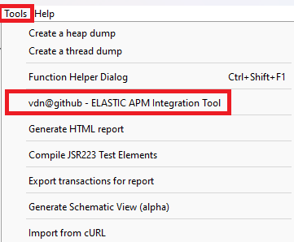
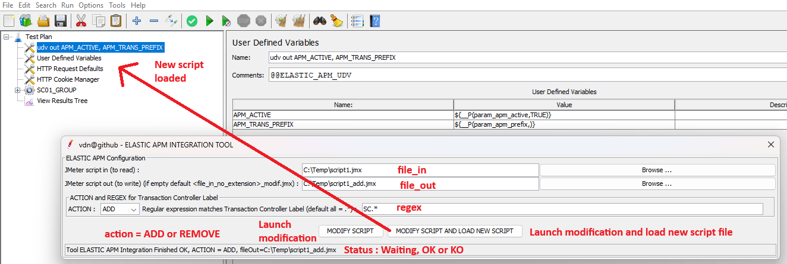

<p align="center">


  <p align="center">Apache JMeter tool plugin to Manage the integration of Elastic Application Performance Monitoring in a JMeter script.</p>
  <p align="center"><a href="https://github.com/vdaburon/elastic-apm-jmeter-plugin">Link to github project elastic-apm-jmeter-plugin</a></p>
</p>

# Apache JMeter tool plugin to manage the Elastic Application Performance Monitoring (ELASTIC APM) in JMeter script

An article "Why and How To Integrate Elastic APM in Apache JMeter" about this plugin and some advices: <br/>
https://dzone.com/articles/integrating-elastic-apm-in-apache-jmeter

## GUI interface in the JMeter Tools Menu
This tool is present in the Menu Tools > vdn@github - ELASTIC APM Integration Tool



When you click and the menu line "ELASTIC APM Integration Tool", the tool GUI is display



### Parameters
Parameters are :
* file_in the JMeter script to read
* file_out the file result, if the text field is empty then the file_out is the file name of file_in without the extension with suffix "_modif.jmx" <br/>
  e.g. file_in = script1.jmx, file_out is empty then file_out will be script1_modif.jmx
* action = ADD or REMOVE, 
  * ADD = Add "User Defined Variables for ELASTIC APM" and add "JSR223 groovy api apm call"
  * REMOVE = remove "User Defined Variables for ELASTIC APM" and remove "JSR223 groovy api apm call", the script will be as before action ADD
* regex the regular expression matches the "Transaction Controller" label, if the label doesn't match the regular expression then **NO** "JSR223 groovy api apm" surround the "Transaction Controller"
  * default all = .* (this regular expression matches all labels)
  * e.g. regex = SC\d+_P.+ matches labels "SC01_P01_LOGIN" or "SC20_P12B_LOGOUT" or SC01_P01_LOGIN|SC02_P02_FIND|SC02_P012_LOGOUT for some Transaction Controllers

Button "MODIFY SCRIPT", this button launch the tool with parameters.<br/>
Button "MODIFY SCRIPT AND LOAD NEW SCRIPT", this button launch the tool with parameters and next if no error LOAD the generated script in the current JMeter.

Status, the status line contains the tool status or the tool result.

e.g. : Status Results **OK**
* Tool ELASTIC APM Integration Finished OK, ACTION = ADD, fileOut=C:\Temp\script1_add.jmx
* Tool ELASTIC APM Integration Finished OK, ACTION = REMOVE, fileOut=C:\Temp\script1_add_modif.jmx

e.g. : Status Results **KO**
* Tool ELASTIC APM Integration Finished KO, CAN'T READ jmx fileIn = C:\Temp\script1zzzz.jmx
* Tool ELASTIC APM Integration Finished KO, exception = java.util.regex.PatternSyntaxException: Unmatched closing ')' near index 1 .*)
* Tool ELASTIC APM Integration Finished KO, CAN'T CREATE or jmx file doesn't exist (look in the log file), fileOut  = c:\toto (in log file : java.io.FileNotFoundException: c:\toto (Access denied)
  )

## More documentation from jmeter-elastic-apm project
For more documentation (Architecture schema, kibana APM dashboard,  JMeter script modified ...) look at README from [jmeter-elastic-apm](https://github.com/vdaburon/jmeter-elastic-apm)

## Command line tool (CLI)
This tool could be use with script shell Windows or Linux.

Scripts shell are in &lt;JMETER_HOME&gt;/bin
* elastic-apm-integrate.cmd for Windows OS
* elastic-apm-integrate.sh for Linux/Mac OS

Help to see all parameters :

<pre>
C:\apache-jmeter\bin&gt;elastic-apm-integrate.cmd -help
usage: io.gihub.vdaburon.jmeter.elasticapmxml.ElasticApmJMeterManager -action &lt;action&gt; [-extract_end &lt;extract_end&gt;]
       [-extract_start &lt;extract_start&gt;] [-extract_udv &lt;extract_udv&gt;] -file_in &lt;file_in&gt; -file_out &lt;file_out&gt; [-help]
       [-regex &lt;regex&gt;]
io.soprasteria.vdaburon.jmeter.elasticapmxml.ElasticApmJMeterManager
 -action &lt;action&gt;                 action ADD or REMOVE, ADD : add groovy api call and REMOVE : remove groovy api call
 -extract_end &lt;extract_end&gt;       optional, file contains groovy end call api (e.g : extract_end.xml), default read file
                                  in the jar
 -extract_start &lt;extract_start&gt;   optional, file contains groovy start call api (e.g : extract_start.xml), default read
                                  file in the jar
 -extract_udv &lt;extract_udv&gt;       optional, file contains User Defined Variables (e.g : extract_udv.xml), default read
                                  file in the jar
 -file_in &lt;file_in&gt;               JMeter file to read (e.g : script.jmx)
 -file_out &lt;file_out&gt;             JMeter file modified to write (e.g : script_add.jmx)
 -help                            Help and show parameters
 -regex &lt;regex&gt;                   regular expression matches Transaction Controller Label (default .*) (e.g : SC[0-9]+_.
                                  for SC01_P01_HOME or SC09_P12_LOGOUT)
E.g : java -jar elastic-apm-jmeter-xml-&lt;version&gt;-jar-with-dependencies.jar -file_in script1.jmx -file_out script1_add.jmx
-action ADD -regex SC.*
E.g : java -jar elastic-apm-jmeter-xml-&lt;version&gt;-jar-with-dependencies.jar -file_in script1_add.jmx -file_out
script1_remove.jmx -action REMOVE -regex .*
</pre>

e.g. action = ADD :
<pre>
C:\apache-jmeter\bin>elastic-apm-integrate.cmd -file_in C:\temp\script1.jmx -file_out C:\temp\script1_add_cli.jmx -action ADD -regex SC.*
</pre>

e.g. action = REMOVE :
<pre>
/var/opt/apache-jmeter/bin>elastic-apm-integrate.sh -file_in /tmp/script1_add.jmx -file_out /tmp/script1_remove_cli.jmx -action REMOVE
</pre>

## Tool installed with jmeter-plugins-manager
This tool could be installed with the jmeter-plugins-manager from jmeter.plugins.org.<br>
The tool name is : "vdn@github - elastic-apm-tool"

## Usage Maven
The maven groupId, artifactId and version, this plugin is in the **Maven Central Repository** [](https://maven-badges.herokuapp.com/maven-central/io.github.vdaburon/elastic-apm-jmeter-plugin)

```xml
<groupId>io.github.vdaburon</groupId>
<artifactId>elastic-apm-jmeter-plugin</artifactId>
<version>2.0</version>
```
## Versions
Version 2.0 2025-01-14, Choose only a jmx file not a directory and add button "MODIFY SCRIPT AND LOAD NEW SCRIPT"

version 1.0  2024-02-06, First release

